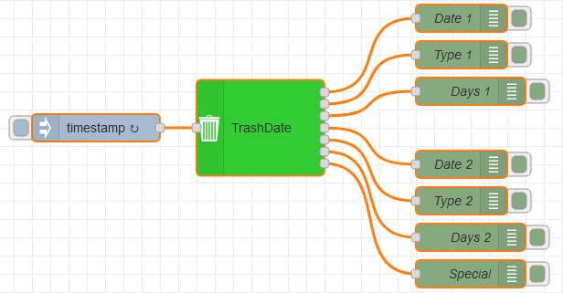

# Node Red TrashDate

[](https://www.npmjs.com/package/@aingtii/node-red-trashdate)
[](https://www.npmjs.com/package/@aingtii/node-red-trashdate)
[](https://github.com/aingtiig/node-red-trashdate/issues)

[](https://nodei.co/npm/@aingtii/node-red-trashdate/)

## Installation
```
npm install @aingtii/node-red-trashdate
```

## Node Description
A node that read an CSV File and generate Date, Type and count the days for next and overnext Date of Trash.</p>

### Settings
1. create an CSV File with two colums
2. Line 1:  col1;col2
3. next lines:  Date;TrashType

|Example                         |
|--------------------------------|
|col1;col2                       |
|05.01.2024;Yellow Bag           |
|12.01.2024;Blue Trash           |
|19.01.2024;Brown Trash          |
|...;... and so on (whole year)  |
|                                |


1. CSV File: path of the CSV File (mandatory)
       like: /opt/iobroker/trashcalendar.csv
2. Name: you can set a name of the node (optional)
 
|Inputs:                                 |
|----------------------------------------|
|just inject, with repetition every Day  |       


|Outputs: |                                   |
|---------|-----------------------------------|
|Output 1 | Date (col1) of next Trash         |
|Output 2 | Type (col2) of the next Trash     |
|Output 3 | Days until next Trash             |
|Output 4 | Date (col1) of overnext Trash     |
|Output 5 | Type (col2) of the overnext Trash |
|Output 6 | Days until overnext Trash         |

### Example Flow


...
[{"id":"5447c1e30f360d63","type":"TrashDate","z":"61b3b2b50abe2c5d","name":"","filename":"/opt/iobroker/Kalender.csv","x":590,"y":720,"wires":[["1ed27416fdf65289"],["abf287d26d38c692"],["beab9eae83db9f1e"],["f02060b5f9b31977"],["7712f374dbd741f7"],["0b2a4fee274720b7"]]},{"id":"7da36d25d832619e","type":"inject","z":"61b3b2b50abe2c5d","name":"","props":[{"p":"payload"},{"p":"topic","vt":"str"}],"repeat":"","crontab":"00 00 * * *","once":false,"onceDelay":0.1,"topic":"","payload":"","payloadType":"date","x":410,"y":720,"wires":[["5447c1e30f360d63"]]},{"id":"1ed27416fdf65289","type":"debug","z":"61b3b2b50abe2c5d","name":"Date 1","active":true,"tosidebar":true,"console":false,"tostatus":false,"complete":"payload","targetType":"msg","statusVal":"","statusType":"auto","x":810,"y":600,"wires":[]},{"id":"abf287d26d38c692","type":"debug","z":"61b3b2b50abe2c5d","name":"Type 1","active":true,"tosidebar":true,"console":false,"tostatus":false,"complete":"payload","targetType":"msg","statusVal":"","statusType":"auto","x":810,"y":640,"wires":[]},{"id":"beab9eae83db9f1e","type":"debug","z":"61b3b2b50abe2c5d","name":"Days 1","active":true,"tosidebar":true,"console":false,"tostatus":false,"complete":"payload","targetType":"msg","statusVal":"","statusType":"auto","x":820,"y":680,"wires":[]},{"id":"f02060b5f9b31977","type":"debug","z":"61b3b2b50abe2c5d","name":"Date 2","active":true,"tosidebar":true,"console":false,"tostatus":false,"complete":"payload","targetType":"msg","statusVal":"","statusType":"auto","x":810,"y":760,"wires":[]},{"id":"7712f374dbd741f7","type":"debug","z":"61b3b2b50abe2c5d","name":"Type 2","active":true,"tosidebar":true,"console":false,"tostatus":false,"complete":"payload","targetType":"msg","statusVal":"","statusType":"auto","x":810,"y":800,"wires":[]},{"id":"0b2a4fee274720b7","type":"debug","z":"61b3b2b50abe2c5d","name":"Days 2","active":true,"tosidebar":true,"console":false,"tostatus":false,"complete":"payload","targetType":"msg","statusVal":"","statusType":"auto","x":820,"y":840,"wires":[]}]
...


